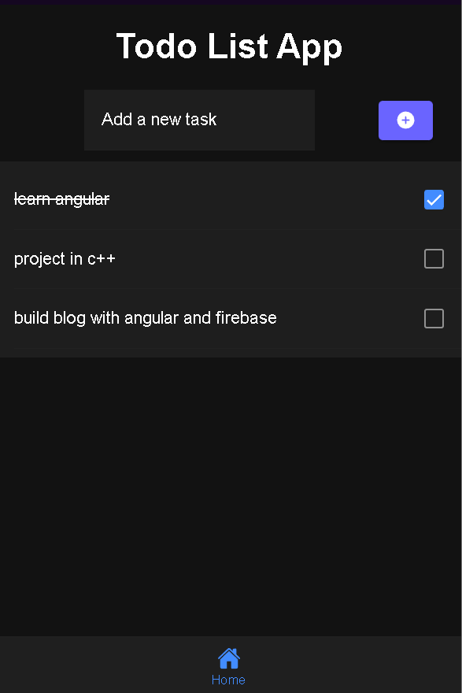

# Todo list App With ionic and angular

#### This is a simple todo list app with ionic and angular.
#### save in localStorage

### Result


## Installation

---
>Clone this repo to your desktop and run `npm install` to install all the dependencies.


```bash
npm install
```

## Usage

---
>Once the dependencies are installed, you can run `ionic serve` to start the application. You will then be able to access it at localhost:8100

```bash
ionic serve
```

